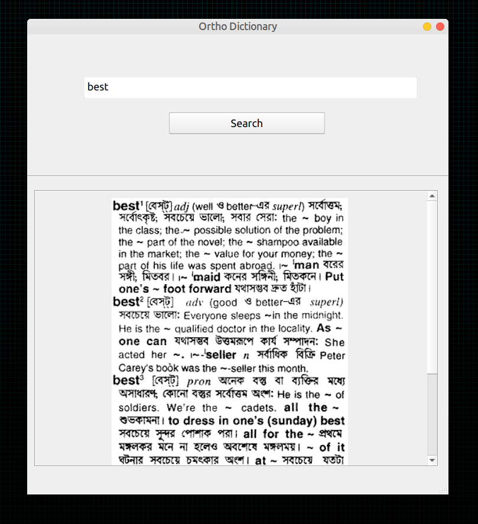

## Ortho is an English to Bangla Dictionary based on Bangla Academy's E2B Database.

 

 

# Features:

- Ove 21000 words directly taken from bangla academy dictionary.
- Super fast word lookup based on hash-map and sqlite database.

 

# Steps to run Ortho Dictionary:

**Ensure python (3.9+) is installed in your system then follow the following steps:**

- Clone the repo or download the source codes.

- Install the dependencies first: `pip3 install -r requirements.txt`

- Then run YDM by this command: `python3 ortho.py`

- The very first run may take some time because the of the extraction process of the sqlite database.
